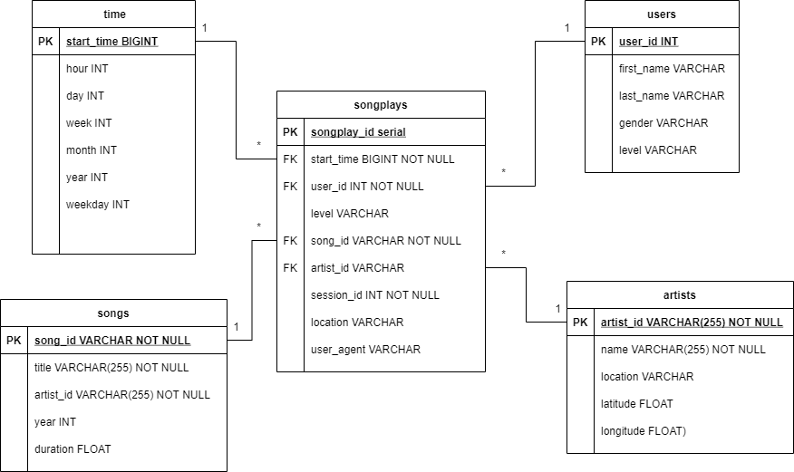

# Introduction 
A startup called Sparkify wants to analyze the data they've been collecting on songs and user activity on their new music streaming app. The analytics team is particularly interested in understanding what songs users are listening to. Currently, they don't have an easy way to query their data, which resides in a directory of JSON logs on user activity on the app, as well as a directory with JSON metadata on the songs in their app.

They'd like a data engineer to create a Postgres database with tables designed to optimize queries on song play analysis, and bring you on the project. Your role is to create a database schema and ETL pipeline for this analysis. You'll be able to test your database and ETL pipeline by running queries given to you by the analytics team from Sparkify and compare your results with their expected results.

# Project Description
In this project, you'll apply what you've learned on data modeling with Postgres and build an ETL pipeline using Python. To complete the project, you will need to define fact and dimension tables for a star schema for a particular analytic focus, and write an ETL pipeline that transfers data from files in two local directories into these tables in Postgres using Python and SQL.

# Project Dataset 
## Song Dataset
The first dataset is a subset of real data from the Million Song Dataset. Each file is in JSON format and contains metadata about a song and the artist of that song. The files are partitioned by the first three letters of each song's track ID. For example, here are filepaths to two files in this dataset.
```
song_data/A/B/C/TRABCEI128F424C983.json
song_data/A/A/B/TRAABJL12903CDCF1A.json
```
And below is an example of what a single song file, TRAABJL12903CDCF1A.json, looks like.
```
{"num_songs": 1, "artist_id": "ARJIE2Y1187B994AB7", "artist_latitude": null, "artist_longitude": null, "artist_location": "", "artist_name": "Line Renaud", "song_id": "SOUPIRU12A6D4FA1E1", "title": "Der Kleine Dompfaff", "duration": 152.92036, "year": 0}
```
## Log Dataset
The second dataset consists of log files in JSON format generated by this event simulator based on the songs in the dataset above. These simulate activity logs from a music streaming app based on specified configurations.

The log files in the dataset you'll be working with are partitioned by year and month. For example, here are filepaths to two files in this dataset.
```
log_data/2018/11/2018-11-12-events.json
log_data/2018/11/2018-11-13-events.json
```
And below is an example of what the data in a log file, 2018-11-12-events.json, looks like.


# Database Schema and ETL
After close examination of the dataset, I have determined to create a Star Schema (shown below) that creates 1 Fact Table and 4 Dimension Tables



ETL Process is performed for the Song Dataset to populate the Songs and Artists table. ETL Process is also performed for the Log Dataset to populate the Time and Users table. More information at the etl.ipynb file.

Hence, this Star Schema will allow simplified queries and fast aggregation for Sparkify 

# Project Respository Files
## create_tables.py
A Python Script that creates the table by running SQL codes from sql_queries.py
## etl.ipynb
A Python Jupyter Notebook that was used to test ETL processes on the data
## etl.py
A Python Script that execute the ETL processes on the data
## sql_queries.py
A Python Script that contains all the necessary SQL codes which includes table creation and insertion
## test.ipynb
A Python Jupyter Notebook that was used to monitor the creation of the table and insertion of the data

# Project Instruction
1. Execute `create_tables.py` file to create the required tables
2. Execute `etl.py` file to perform ETL processes and populate the tables
3. Execute `test.ipynb` to test if the tables and data have been performed correctly